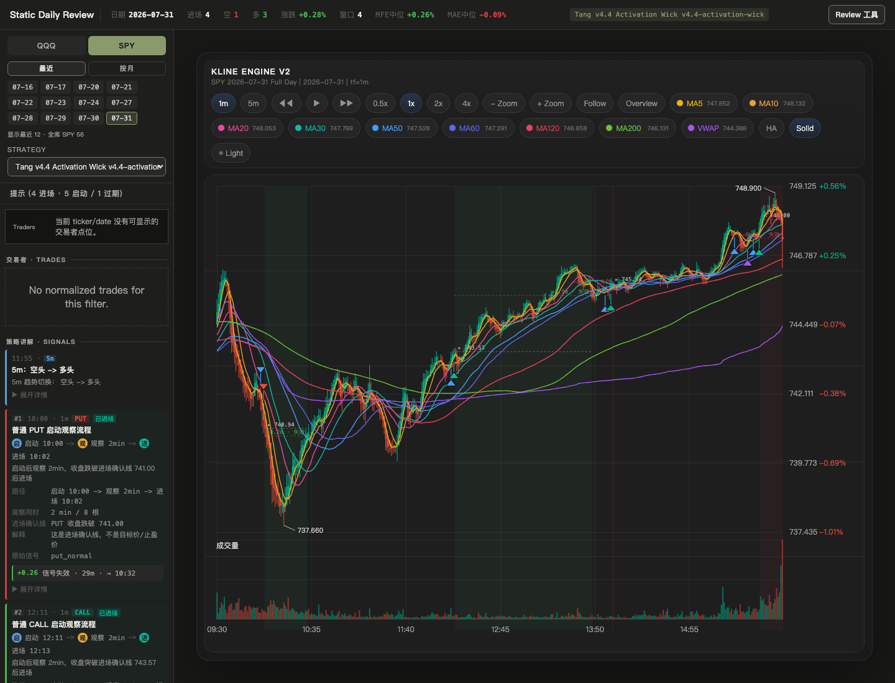
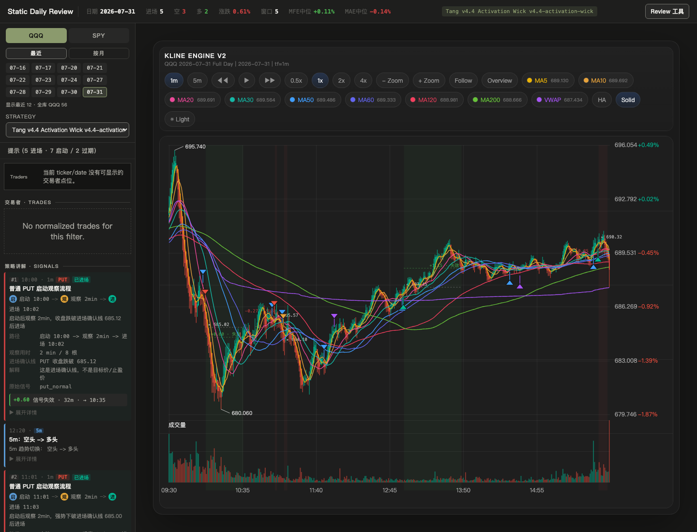
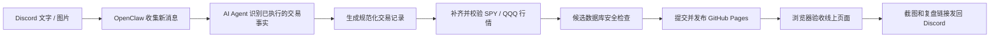

# Tang Strategy：交易复盘与自动发布系统

> 把散落在聊天里的交易记录、当天行情和盘后复盘，整理成一条能核对、能回看、也能自动发布的完整链路。

[在线查看 Tang Strategy](https://tuskijay.github.io/tang-strategy/)

## 这是什么

交易发生时，信息往往很碎：一句进场、一张截图、几次加减仓，再加上当天的 K 线。等到盘后真正想复盘时，很容易只记得结果，却说不清当时做了什么、为什么这么做。

Tang Strategy 做的事，就是把这些碎片重新放回同一张图里：

- 用 SPY、QQQ 的 1 分钟和 5 分钟行情还原当天走势；
- 把开仓、加仓、减仓和平仓标到对应时间；
- 按交易员、日期和策略查看完整过程；
- 在浏览器里做单日回测和逐步教学回放；
- 把验证通过的复盘发布成无需登录的静态页面。

它不是自动下单系统，也不提供投资建议。它的价值不在于替人做决定，而在于把已经发生的交易讲清楚、留下来，并且经得起回看。

## 现在能看到什么

### 盘后复盘

`Review` 页面把全天 K 线、策略信号和真实交易节点放在一起。你可以在 1 分钟 / 5 分钟周期之间切换，查看不同交易员的进出场过程，也可以沿着完整时间轴回到当时的市场位置，而不是只看一张事后截图。

下面是 2026-07-31 生产发布后的 `Daily Review` 实际页面（点击图片可查看原图）：

| SPY Daily Review | QQQ Daily Review |
| --- | --- |
| [](./docs/assets/readme/daily-review-spy-2026-07-31.png) | [](./docs/assets/readme/daily-review-qqq-2026-07-31.png) |

### 策略回测

`Backtest` 页面可以在选定交易日上运行仓库里的策略规则，用同一套行情数据检查信号出现在哪里。它更适合回答“这套规则在这一天是怎么工作的”，而不是承诺未来收益。

### 教学回放

`Teaching` 页面按时间逐步展开行情，让规则、案例和当时的 K 线互相对应。它把“看懂一张复盘图”拆成可以一步步学习的过程。

### 在线发布

公开页面由 GitHub Pages 托管。每次正式发布都会从同一份已验证的 SQLite 数据库导出静态数据，再构建网页，因此本地复盘和线上复盘使用的是同一套事实来源。

## OpenClaw 如何参与

更准确地说，OpenClaw 不是复盘结果的终点，而是这条自动化链路的执行者：它从指定的 Discord 频道收集新消息，让受限的 `AI Agent` 负责理解文字和图片，再由确定性的 Runner 整理数据、驱动 Tang Strategy 完成发布，最后把结果发回 Discord。



生产任务目前在每个美股交易日的纽约时间 20:30 自动运行。一次正常运行大致会做这些事：

1. 只读取上次处理位置之后的新消息，文字和图片都可以进入识别；
2. `AI Agent` 区分“已经成交”“交易更新”“分析”“计划”和“无法确认”，只让证据完整的已执行交易进入正式记录；
3. 再次回读原消息，确认作者、时间和内容没有发生漂移；
4. 获取同一天的 SPY / QQQ 行情，两者必须来自同一数据源并一起通过质量检查；
5. 在候选数据库中完成结构、完整性和数据不缩水检查，通过后才替换正式数据库；
6. 只提交本次交易日涉及的内容，推送后等待 GitHub Pages 构建完成；
7. 打开线上 SPY / QQQ 页面，确认 K 线、交易记录和构建版本都正确；
8. 最后把复盘摘要、两张页面截图和对应链接发回 Discord，并重新读取消息确认发送成功。

如果当天内容已经发布，任务会返回 `already_current`，不会重复提交，也不会重复发消息。

## 自动化的安全边界

这里的“自动”不等于“猜着做”。这条链路遵循几个很朴素的原则：

- 聊天时间不等于成交时间；没有明确证据就保留为空；
- “看多”“准备买”“如果突破就进”属于分析或计划，不会被写成已成交；
- 图片无法读取时，不根据文件名或上下文猜图里的内容；
- SPY 和 QQQ 必须成对更新，任何一边不合格都不发布半套数据；
- 原始聊天记录、截图和附件不会进入公开数据，只发布整理后的必要事实；
- GitHub Pages、线上页面或 Discord 回执有一步无法确认，就停止并保留可恢复记录，不冒充成功；
- 这条链路只负责复盘数据和页面发布，不连接券商下单。

行情默认先使用 TradingView。只有在重试失败或明确的数据质量检查不通过后，才把 IB Gateway 作为后备来源。无论使用哪个来源，同一天的 SPY 和 QQQ 都不会混用供应商。

## 技术结构

- `backend/app/`：FastAPI、登录鉴权、数据库访问、数据导入和复盘组装；
- `backend/scripts/`：行情获取、安全重建、恢复和静态数据导出；
- `frontend/src/`：`Data`、`Review`、`Backtest`、`Teaching` 和共用 K 线组件；
- `strategies/`：策略定义和策略说明；
- `content/`：教学内容、规则、案例、交易员与规范化交易记录；
- `data/sqlite/tang_strategy_live_extended.db`：交互页面和 GitHub Pages 共用的正式数据源；
- `docs/`：架构、运行手册和受控的开发记录。

本地抓取到的原始行情位于 `data/seed/market-data/live_extended/`，它只是导入输入，不是线上页面直接读取的数据。

## 本地运行

最快的方式是启动完整 Docker 环境：

```bash
cp .env.example .env
docker compose up --build
```

前端地址为 `http://localhost:18080`，后端地址为 `http://localhost:18091`。

只启动后端：

```bash
cd backend
python -m venv .venv
. .venv/bin/activate
pip install -r requirements.txt
PYTHONPATH=. uvicorn app.main:app --reload
```

只启动前端：

```bash
cd frontend
npm install
npm run dev
```

## 更新一个交易日

在 `backend/` 下运行：

```bash
PYTHONPATH=. python scripts/update_spy_qqq_market_day.py <YYYY-MM-DD> --provider tradingview
```

这个入口会获取并校验同一天的 SPY / QQQ，先重建候选数据库，全部通过后再原子替换正式数据库。日常流程不要使用 `--allow-date-loss` 绕过数据缩水保护。

如果只需要根据现有本地输入安全重建数据库：

```bash
cd backend
PYTHONPATH=. python scripts/rebuild_live_extended_db.py
```

## 验证

```bash
python3 scripts/verify.py
```

这条命令会读取 `.harness/config.json` 中唯一的验证清单，依次检查项目结构、后端测试、前端测试和构建结果。

仓库协作规则见 [`AGENTS.md`](./AGENTS.md)，稳定技术约定见 [`INSTRUCTIONS.md`](./INSTRUCTIONS.md)，文档入口见 [`docs/README.md`](./docs/README.md)，每日发布细节见 [`docs/daily-publish-runbook.md`](./docs/daily-publish-runbook.md)。
